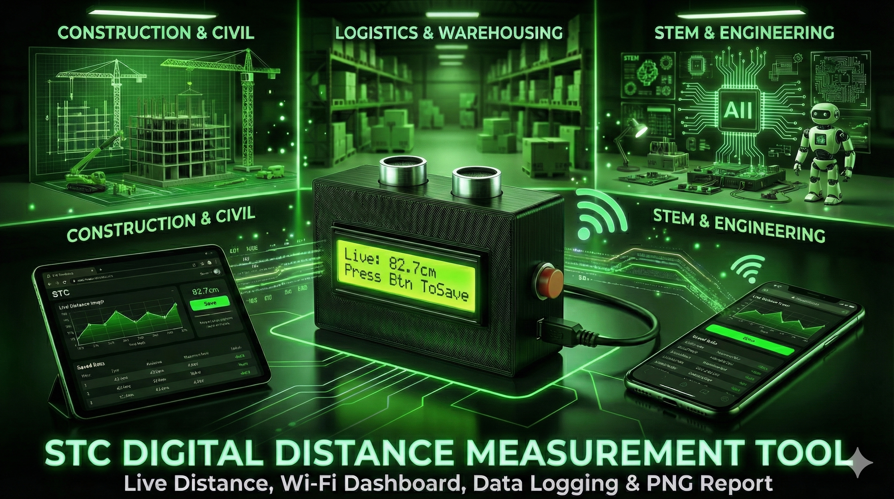

# <h1 align="center">📏 STC DIGITAL DISTANCE MEASUREMENT TOOL 📏</h1>

  <b>Smart IoT-Based Wireless Distance Measurement Device</b> 
  <em>ESP8266 • Ultrasonic Sensor • I²C LCD • Web Dashboard • PNG Report Export</em>

---

  

---

## ✨ Overview

The **STC Digital Distance Measurement Tool** is a **smart, portable, offline IoT device** designed to replace traditional measuring tapes.  
It uses:

- ⚡ **ESP8266 NodeMCU**
- 📡 **Ultrasonic Sensor (HC-SR04)**
- 🖥 **16×2 I²C LCD**
- 🌐 **Wireless Web Dashboard (192.168.4.1)**  
- 🔉 **Physical Save Button + Buzzer Feedback**

This tool measures distances, displays them on LCD + web dashboard, **saves multiple measurements**, and allows **one-click PNG report download** — all completely offline.

---

## 🌈 Official Version Details

### 🧰 ESP8266 Board Info  
ESP8266 Arduino Core : **3.x.x**

### 📚 Library Versions

| Library | Version | Emoji |
|--------|---------|-------|
| ESP8266WiFi | Built-in | 📡 |
| ESP8266WebServer | Built-in | 🌐 |
| ArduinoJSON | Latest | 🧠 |
| LiquidCrystal_I2C | Latest | 🖥 |
| Wire | Default | ⚙ |
| LittleFS | Default | 💾 |

---

## 📸 Project Photos

  

---

## 📸 Web Dashboard (Live Distance View)

  

---

## 🚀 Key Functional Features

### ✔ **1. Live Distance Measurement**
- High-accuracy ultrasonic sensor
- Real-time value on LCD & web dashboard

### ✔ **2. Dual Save Options**
- 🟦 Physical button save  
- 🟩 Web dashboard save  
- Both trigger buzzer beep  
- Both update saved table instantly  

### ✔ **3. Saved Measurement Table**
- Stores up to **20 readings**
- Organized clean layout
- Auto numbering

### ✔ **4. Clear All Data**
- One click reset  
- Clears table + memory + LCD message  

### ✔ **5. PNG Report Download**
Exports an STC-branded PNG containing:
- Title  
- Time-stamped data  
- Total entries  
- Professional layout  

### ✔ **6. Modern Web UI**
- Center large distance display  
- Save button  
- Clear button  
- Download button  
- Auto-updating live feed  

### ✔ **7. Fully Offline Operation**
- No internet required  
- ESP8266 runs in **Access Point Mode (AP)**  

---

## 🔧 Hardware Components

| Component | Purpose | Emoji |
|----------|----------|-------|
| ESP8266 NodeMCU | Main controller + WiFi AP | ⚡ |
| HC-SR04 Ultrasonic | Distance measurement | 📏 |
| 16×2 LCD (I²C) | Local live display | 🖥 |
| Buzzer | Save feedback | 🔊 |
| Push Button | Physical save | 🔘 |
| Zero PCB | Stable permanent wiring | 🧱 |
| Enclosure | Portability & safety | 📦 |

---

## 🧩 Wiring Diagram (Text Format)

### 🔗 Ultrasonic Connections

| Sensor Pin | ESP8266 Pin | Emoji |
|------------|-------------|-------|
| VCC | 5V | 🔋 |
| GND | GND | ⚫ |
| TRIG | D6 | 📤 |
| ECHO | D7 | 📥 |

---

### 🖥 LCD (I²C) Connections

| LCD Pin | ESP8266 Pin | Emoji |
|---------|-------------|-------|
| VCC | 3.3V/5V | 🔋 |
| GND | GND | ⚫ |
| SDA | D2 | 🔵 |
| SCL | D1 | 🟢 |

---

### 🔘 Button + 🔊 Buzzer

| Function | ESP8266 Pin |
|----------|-------------|
| Save Button | D5 |
| Buzzer | D3 |

---

## 📡 Wi-Fi Access Point Details

SSID : STC_DISTANCE_AP
PASS : 12345678
IP : 192.168.4.1

📲 **Open Dashboard:**  
👉 http://192.168.4.1

---

## 🚦 System Flow (How It Works)

1. ESP8266 powers ON → Creates WiFi hotspot  
2. User connects mobile → **STC_DISTANCE_AP**  
3. User opens → **192.168.4.1**  
4. Ultrasonic sensor continuously reads distance  
5. Live distance updates on:  
   ✔ LCD  
   ✔ Web Dashboard  
6. Data can be saved via:  
   ✔ Physical Save Button  
   ✔ Web Save Button  
7. Buzzer gives confirmation beep  
8. Saved entries appear in a table  
9. User can:  
   ✔ Download PNG report  
   ✔ Clear all data  

---

## 🏭 Real-World Applications

### 🏗 Construction & Civil Engineering
- Room measurements  
- Height/width calculations  
- Wall spacing  

### 🏠 Architecture & Interior
- Furniture placement  
- Modular kitchen planning  

### 📦 Warehousing & Logistics
- Box measuring  
- Shelf gap checking  

### 🏭 Manufacturing
- QC measurements  
- Machine spacing  

### 🏫 Schools & Engineering Colleges
- IoT demonstration  
- Sensor & dashboard teaching  

### 🎒 Science Exhibitions
- Ready-to-present  
- Attractive web dashboard  

### 🔨 DIY & Carpentry
- Wood cutting  
- Indoor measurements  

---

## 🌟 Advantages

- Accurate ultrasonic readings  
- Offline IoT dashboard  
- Dual save option  
- PNG report export  
- Portable & enclosure-based  
- STC-branded UI  
- Beginner-friendly  
- Ideal STEM learning tool  

---

## 🎯 Why This Project is Unique?

- **Hardware + IoT Web App + PNG Reporting** – all in ONE device  
- Works fully offline  
- Professional STC report export  
- Perfect for field, education, engineering, exhibitions  

---

## 📁 Project Structure

📦 STC-Distance-Tool
┣ 📜 README.md
┣ 📜 ESP8266_Distance_Tool.ino
┗ 📂 images/
┣ hero.png
┣ lcd.png
┣ dashboard.png
┣ pcb.png
┗ report.png

---

## 🛠 Setup & Installation

### 1️⃣ Install Board
Arduino IDE → Boards Manager → **ESP8266** → Install

### 2️⃣ Install Libraries
- ESP8266WebServer  
- ArduinoJSON  
- LiquidCrystal_I2C  
- LittleFS  

### 3️⃣ Upload Code  
- Board → **NodeMCU 1.0 (ESP-12E)**  
- Select COM port  
- Upload  

---

## 🔬 Testing Sequence

1. Power ON  
2. LCD shows live distance  
3. Connect to AP  
4. Open dashboard  
5. Try saving a measurement  
6. Buzzer confirms  
7. Check table  
8. Download PNG  
9. Clear all data  

---

## 🛠 Troubleshooting

### ❌ LCD Not Showing  
✔ Check SDA=D2, SCL=D1  
✔ Address: 0x27 or 0x3F  

### ❌ Echo Always Zero  
✔ TRIG/ECHO wiring  
✔ Avoid long wires  

### ❌ Dashboard Not Opening  
✔ Connect to STC_DISTANCE_AP  
✔ Disable mobile data  

### ❌ Save Button Not Working  
✔ Ensure pull-down resistor  
✔ Check D5 connection  

---

## 🧭 Future Enhancements (v2.0)

- Bluetooth data sync  
- Cloud storage  
- Auto distance logging  
- Color LCD display  
- Rechargeable battery  

---

## © License  
Open-source for educational + research use.

---

  Made with ❤️ by <b>STC Creative Club</b>

